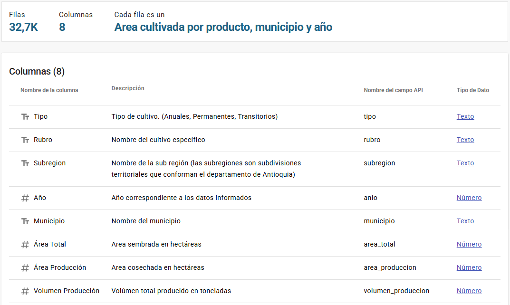
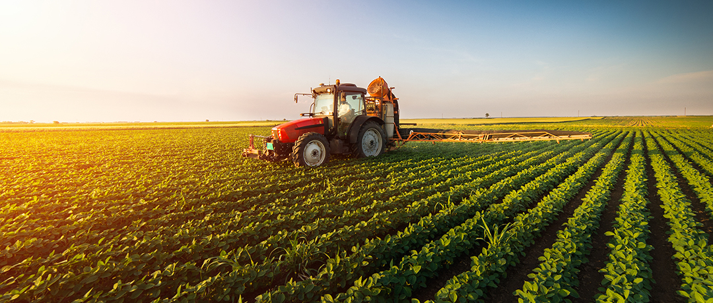

# Produccion-agricola-datascience
Este proyecto analiza las áreas cultivadas y la producción agrícola en el departamento de Antioquia, Colombia, desde 1990 hasta 2022.

Contiene las Evaluaciones Agrícolas por consenso, presentando los indicadores de áreas, producción y 
los rendimientos de los cultivos permanentes, transitorios y anuales desde el año 1990 y se actualiza cada año con los datos del año anterior.

Para más detalles:
https://www.datos.gov.co/Agricultura-y-Desarrollo-Rural/Areas-cultivadas-y-produccion-agr-cola-en-Antioqui/t2ca-uae5/about_data

# Storytelling

Una multinacional agrícola busca invertir 20 mil millones de pesos en Antioquia. 
📅 Espera obtener un retorno de inversión (ROI) en menos de 1 año. 
📍 La empresa muestra preferencia por las subregiones de Urabá y Oriente, pero no descarta otras.
🌱 Su objetivo es maximizar el rendimiento por hectárea y tomar decisiones informadas basadas en la calidad de la tierra y la productividad histórica

🎯 Pregunta de negocio:
¿En qué rubro, en qué subregión y en qué tipo de cultivo se puede invertir con alta probabilidad de éxito y rentabilidad agrícola en un plazo de 1 año?

# Marco de trabajo 

Modelo CRISP DM

# Orange 

Los modelos construídos en Orange con mejor rendimiento son:

